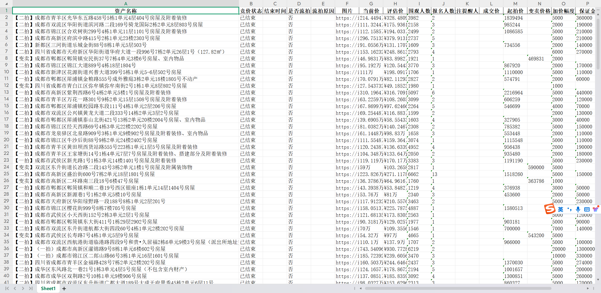
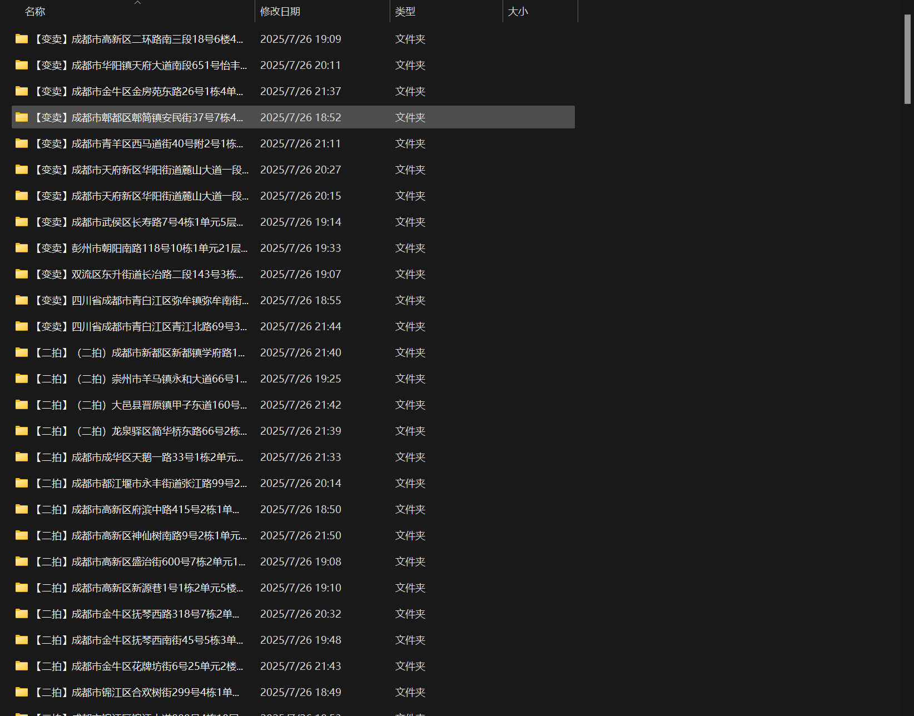

# 房产信息爬虫项目

这是一个结构化的房产信息爬虫项目，包含京东法拍房和链家二手房两个爬虫模块。

## 项目结构

```
estate_info_crawl/
├── config.py                 # 配置文件
├── main.py                   # 主程序入口
├── requirements.txt          # 项目依赖
├── README.md                # 项目说明
├── utils/                   # 工具模块
│   ├── __init__.py
│   ├── logger.py            # 日志工具
│   ├── browser.py           # 浏览器工具
│   └── data_storage.py      # 数据存储工具
├── spiders/                 # 爬虫模块
│   ├── __init__.py
│   ├── base_spider.py       # 爬虫基类
│   ├── jd_auction_spider.py # 京东法拍房爬虫
│   └── lianjia_spider.py    # 链家二手房爬虫
├── data/                    # 数据目录
├── logs/                    # 日志目录
└── output/                  # 输出目录
```

## 功能特性

### 京东法拍房爬虫
- 使用undetected-chromedriver绕过反爬虫检测
- 支持手动登录京东账号
- 自动选择地区（广东-深圳）
- 爬取拍卖详情信息
- 自动下载附件和图片
- 支持分页爬取
- **支持截止时间过滤**：当拍卖结束时间早于设定时间时自动停止爬取
- **支持断点续传**：从上次爬取停止的位置继续爬取，避免重复数据
- 数据保存为Excel格式

### 链家二手房爬虫
- 支持深圳所有区域的二手房数据爬取
- 自动处理登录验证
- 支持分页爬取
- 数据按区域分别保存
- 支持日期过滤

## 安装依赖

```bash
pip install -r requirements.txt
```

## 使用方法

### 1. 京东法拍房爬虫

首次运行：
```bash
python main.py --spider jd
```
程序会自动：
1. 创建Chrome用户数据目录
2. 打开京东法拍网站
3. 提示您手动登录
4. 登录成功后自动保存登录信息

程序会自动：
1. 检测登录状态
2. 如果已登录，直接开始爬取
3. 如果登录失效，提示重新登录

```bash
# 基本使用
python main.py --spider jd

# 指定开始页码和最大页数
python main.py --spider jd --jd-start-page 5 --jd-max-pages 10

# 使用截止时间功能（只爬取结束时间在指定时间之后的拍卖）
python main.py --spider jd --jd-cutoff-time "2024-01-01 00:00:00"

# 组合使用多个参数（选择省份和城市为广东-深圳）
python main.py --spider jd --jd-start-page 1 --jd-max-pages 20 --jd-province gd --jd-city sz --jd-cutoff-time "2024-01-01 12:00:00"

# 使用断点续传功能（从上次停止的位置继续爬取）
python main.py --spider jd --jd-province gd --jd-city sz --jd-resume-from-archive
```

### 京东法拍房省份和城市参数说明

京东法拍房爬虫支持以下省份和城市参数：

#### 支持的省份代码：
- `gd` - 广东省
- `zj` - 浙江省  
- `bj` - 北京市
- `sh` - 上海市
- `sc` - 四川省
- `hb` - 湖北省

#### 支持的城市代码：
- `sz` - 深圳市（广东省）
- `hz` - 杭州市（浙江省）
- `cd` - 成都市（四川省）
- `wh` - 武汉市（湖北省）

#### 省份与城市对应关系：
- 广东省 (`gd`) → 深圳市 (`sz`)
- 浙江省 (`zj`) → 杭州市 (`hz`)
- 四川省 (`sc`) → 成都市 (`cd`)
- 湖北省 (`hb`) → 武汉市 (`wh`)
- 北京市 (`bj`) → 无下属城市
- 上海市 (`sh`) → 无下属城市

#### 使用示例：
```bash
# 爬取广东省深圳市的数据
python main.py --spider jd --jd-province gd --jd-city sz

# 爬取北京市的数据（直辖市，无需指定城市）
python main.py --spider jd --jd-province bj
```
### 2. 链家二手房爬虫

```bash
# 爬取所有区域
python main.py --spider lianjia

# 爬取指定区域
python main.py --spider lianjia --lianjia-districts 南山区 福田区

# 限制每个区域的最大页数
python main.py --spider lianjia --lianjia-max-pages 5
```

### 链家二手房区域参数说明

链家二手房爬虫目前支持深圳市的以下区域：

#### 支持的深圳区域：
- **罗湖区**：百仕达、布心、春风路、翠竹、地王、东门、洪湖、黄贝岭、黄木岗、莲塘、罗湖口岸、螺岭、清水河、笋岗、万象城、新秀、银湖
- **福田区**：八卦岭、百花、车公庙、赤尾、福田保税区、福田中心、皇岗、黄木岗、华强北、华强南、景田、莲花、梅林、上步、上下沙、沙尾、石厦、香梅北、香蜜湖、新洲、银湖、园岭、竹子林
- **南山区**：白石洲、大学城、红树湾、后海、华侨城、科技园、南山中心、南头、前海、蛇口、深圳湾、西丽
- **盐田区**：梅沙、沙头角、盐田港
- **宝安区**：宝安中心、碧海、翻身、福永、航城、沙井、石岩、松岗、桃源居、曦城、新安、西乡
- **龙岗区**：布吉大芬、布吉关、布吉街、布吉南岭、布吉石芽岭、布吉水径、丹竹头、大运新城、横岗、龙岗宝荷、龙岗双龙、龙岗中心城、坪地、平湖
- **龙华区**：坂田、观澜、红山、龙华新区、龙华中心、梅林关、民治、上塘
- **光明区**：公明、光明
- **坪山区**：坪山
- **大鹏新区**：大鹏半岛

#### 使用示例：
```bash
# 爬取所有区域
python main.py --spider lianjia

# 爬取指定区域
python main.py --spider lianjia --lianjia-districts 南山区 福田区

# 爬取多个区域
python main.py --spider lianjia --lianjia-districts 罗湖区 福田区 南山区

# 限制每个区域的最大页数
python main.py --spider lianjia --lianjia-max-pages 5
```

### 3. 同时运行两个爬虫

```bash
python main.py --spider both
```

### 4. 查看可用区域

```bash
python main.py --show-districts --spider xx
```

## 参数快速参考

### 京东法拍房参数
| 参数 | 说明 | 示例 |
|------|------|------|
| `--jd-province` | 省份代码 | `gd`(广东)、`zj`(浙江)、`bj`(北京)、`sh`(上海)、`sc`(四川)、`hb`(湖北) |
| `--jd-city` | 城市代码 | `sz`(深圳)、`hz`(杭州)、`cd`(成都)、`wh`(武汉) |
| `--jd-start-page` | 开始页码 | `1` |
| `--jd-max-pages` | 最大页数 | `10` |
| `--jd-cutoff-time` | 截止时间 | `"2024-01-01 00:00:00"` |
| `--jd-resume-from-archive` | 断点续传 | 无需参数，添加此选项即可启用 | 最好配合--jd-start-page参数一起使用，以便快速定位到开始爬取信息所在页 |

### 链家二手房参数
| 参数 | 说明 | 示例 |
|------|------|------|
| `--lianjia-districts` | 区域名称 | `南山区`、`福田区`、`罗湖区`等 |
| `--lianjia-max-pages` | 每个区域最大页数 | `5` |

## 配置说明

所有配置参数都在 `config.py` 文件中，包括：

- 浏览器配置
- 爬虫参数
- 区域映射
- 日志设置
- 输出路径

## 输出文件

- 京东法拍房数据概览：`output/京东法拍房_数据.xlsx`

- 链家二手房数据：`output/链家二手房_区域名.xlsx`
- 日志文件：`logs/爬虫名称.log`
- 附件和图片：`output/京东法拍/资产名称/`


## 断点续传功能详解

### 工作原理
1. **自动扫描存档**：程序启动时自动扫描 `/output` 目录下的所有 `京东法拍房_数据_错误保存.xlsx` 文件
2. **读取最后记录**：获取文件中最后一条记录的"资产名称"
3. **定位续爬点**：在爬取过程中跳过所有记录，直到找到匹配的资产名称
4. **开始续爬**：从匹配记录的下一条开始正式爬取新数据

### 使用场景
- **长时间爬取中断**：当爬取过程被意外中断时，可以从断点继续
- **避免重复数据**：避免重复爬取已经获取的数据
- **提高爬取效率**：节省时间和资源

### 使用示例
```bash
# 第一次运行（正常爬取）
python main.py --spider jd --jd-province gd --jd-max-pages 10

# 第二次运行（断点续传）
python main.py --spider jd --jd-province gd --jd-max-pages 20 --jd-resume-from-archive
```
python main.py --spider jd --jd-province sc --jd-city cd --jd-start-page 140 --jd-max-pages 999 --jd-cutoff-time "2017-01-01 00:00:00"
### 注意事项
- 存档文件必须位于 `/output` 目录下名称必须为“京东法拍房_数据_错误保存.xlsx”
- 程序会显示详细的日志信息，包括跳过的记录和找到的续爬点

## 注意事项

1. **京东法拍房爬虫**：
   - 使用undetected-chromedriver自动启动浏览器
   - 每次运行都需要手动登录京东账号
   - 建议在非工作时间运行，避免被反爬
   - **截止时间功能**：
     - 时间格式必须为：`YYYY年MM月DD日 HH:MM:SS`
     - 例如：`2024年01月15日 12:30:00`
     - 当发现拍卖结束时间早于截止时间时，爬虫会停止并保存已收集的数据
     - 该功能可用于只爬取最近的拍卖数据，提高效率
   - **断点续传功能**：
     - 自动读取 `/output` 目录下最新的 `京东法拍房_数据_错误保存.xlsx` 文件
     - 获取最后一条记录的"资产名称"
     - 从该记录的下一条开始继续爬取
     - 避免重复爬取已有数据，提高爬取效率
     - 适用于长时间爬取中断后的恢复

2. **链家二手房爬虫**：
   - 程序会自动打开浏览器
   - 需要手动完成登录验证
   - 建议设置合理的延时和页数限制

3. **通用注意事项**：
   - 请遵守网站的robots.txt规则
   - 建议设置合理的爬取频率
   - 数据仅供学习研究使用

## 扩展开发

### 添加新的爬虫

1. 继承 `BaseSpider` 类
2. 实现 `run()` 方法
3. 在 `main.py` 中添加相应的参数处理

### 修改配置

直接编辑 `config.py` 文件中的相应配置项。

### 自定义数据存储

继承或修改 `DataStorage` 类来实现自定义的数据存储方式。

## 许可证

本项目仅供学习和研究使用，请遵守相关网站的使用条款。 